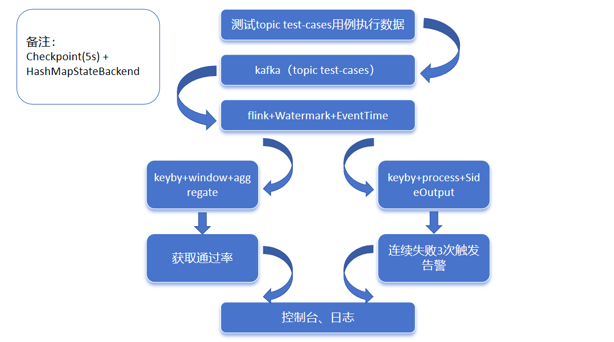
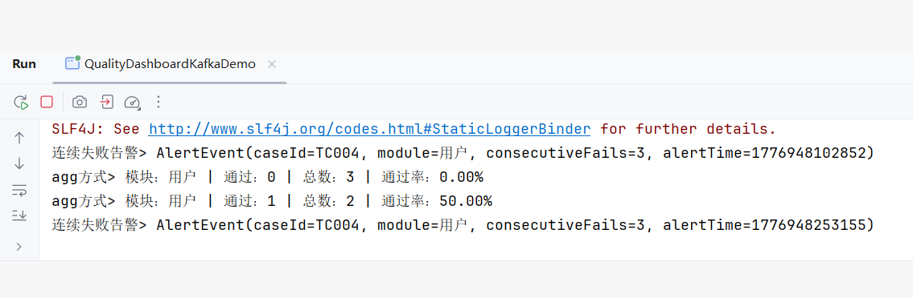

# Java 基础学习 - 实时数据转型

## Day 2（2026.04.10）

### 今日目标

理解 Java 静态/实例方法 和 匿名内部类，建立 Flink API 的语法基础。

### 完成内容

- [x] MathUtil.java：静态方法 `add()` vs 实例方法 `multiply()`
- [x] 理解 `env.readTextFile()` 的调用方式（对象.实例方法）
- [x] Button.java：匿名内部类实现 `ClickListener` 接口
- [x] 识别 Flink WordCount 中的 2 处匿名内部类用法

### 关键理解

| Java 概念                       | Flink 对应                                               |
|-------------------------------|--------------------------------------------------------|
| 静态方法 `MathUtil.add()`         | `StreamExecutionEnvironment.getExecutionEnvironment()` |
| 实例方法 `util.multiply()`        | `env.readTextFile("file.txt")`                         |
| 匿名内部类 `new ClickListener(){}` | `new FlatMapFunction(){}`                              |

### 代码文件

- `MathUtil.java`：静态 vs 实例方法对比
- `Button.java`：匿名内部类回调机制
- `WorldCountStreamDemo.java`：标注匿名内部类位置（2处）

### 明日计划

- 泛型方法：`Box<T>` 与 `DataStream<T>`
- 用 Java 模拟 Flink 的链式调用

---

**状态**：在职学习，32岁转型实时数据工程师。

## day 3 (2026.04.11)

### 今日目标

-[x] Box<T> 泛型类
-[x] 泛型类方法swap(Box<T> a,Box<T> b)
-[x] SimpleStream<T>模拟Flink链式调用(map + filter)

### 关键理解

-[x] java中Box<T> 可对照 DataStream<T>
-[x] 泛型类方法swap<T> 可对照 map<R>(),filter<T>()
-[x] 方法返回this/新对象 可对照 链式调用 stream.map().filter()

### 代码文件

- Box.java
- SimpleStream.java

### 明日计划

- 类型擦除 (理解泛型底层)
- 开始Flink DataStream API 实战

## Day 4（2026.04.13）

### 今日目标

独立写Flink WordCount，理解类型擦除

### 完成内容

- [x] Flink WordCount完整实现（临摹→独立写→对照）
- [x] 类型擦除理解：运行时`Box<String>`和`Box<Integer>`是同一个类
- [x] 掌握泛型限制：不能`instanceof T`，不能`new T()`

### 关键理解

| 概念                  | 说明                               |
|---------------------|----------------------------------|
| DataStreamSource<T> | extends DataStream<T>，泛型参数在运行期擦除 |
| 类型擦除                | 编译期检查类型安全，编译期生成字节码时变成原始类型        |
| 匿名内部类               | flatMap/map/keyBy中大量使用，实现函数式接口   |

### 代码文件

- WorldCount.java（独立实现）

### 明日计划

- Flink算子深入：flatMap vs map vs filter
- 状态管理概念

## Day 5（2026.04.14）

### 今日目标

理解map、flatmap、filter的区别，理解状态管理基础

### 完成内容

- [x] map、flatmap、filter代码对照
- [x] 状态管理基础示例

### 关键理解

算子 作用 输入条数 输出条数 效果
map 一对一转换 1 条 1 条 变个样子
filter 过滤 1 条 0 条 或 1 条 留下符合条件的
flatMap 一对多展开 1 条 0 条 / 1 条 / 多条 拆开、打散、输出多个

特性 普通局部变量 Flink ValueState 状态
跨数据保存 ❌ 不保存 ✅ 永久保存
key 隔离 ❌ 共用 ✅ 每个 key 独立存储
容错恢复 ❌ 重启丢失 ✅ 自动恢复
多并行度安全 ❌ 线程不安全 ✅ 框架管理，安全
过期清理 ❌ 不能 ✅ 支持 TTL 自动清理

### 代码文件

- MapFilterFlatMap.java（独立实现）
- KeyedValueStateDemo.java（参照完成）

### 明日计划

- Flink集群架构

## Day 6（2026.04.15）

### 今日目标

补充Flink架构基础，建立分布式视角

### 完成内容

- [x] Flink架构：JobManager/TaskManager/Slot
- [x] 算子链：flatMap+map+filter如何变成执行任务
- [x] 分布式视角理解ValueState（状态存在TaskManager内存）

### 关键理解

| 组件          | 作用         | 与ValueState的关系        |
|-------------|------------|-----------------------|
| JobManager  | 协调调度，分配任务  | 触发Checkpoint保存状态      |
| TaskManager | 实际执行代码     | 状态存在其内存（Heap/RocksDB） |
| Slot        | 资源单元       | 一个Slot运行一个任务链         |
| 算子链         | 优化执行，减少序列化 | map/filter可能合并为一个任务   |

### 架构图（手绘理解）

关于 TaskManager 与状态存储
你的描述：“状态存在其内存（Heap/RocksDB）”
补充：完全正确。更准确地说，是存在 TaskManager 进程所在的本地资源中。
如果是 Heap 模式：直接占用 TaskManager 的 JVM 堆内存。
如果是 RocksDB 模式：占用 TaskManager 配置的 本地磁盘目录（同时利用堆外内存做缓存）。
分布式视角：这意味着状态是分散在集群各个 TaskManager 节点上的，而不是集中在 JobManager 或某个中心数据库里。

关于 JobManager 与状态
你的描述：“触发 Checkpoint 保存状态”
补充：JobManager 是 Checkpoint 的指挥官，但它不存储业务状态数据。
它负责定期发送 Barrier（屏障）给 Source，触发整个数据流的快照。
真正的状态数据（State Data）是由 TaskManager 汇报给远程存储（如 HDFS/S3）的。JobManager 只保存“元数据”（即：最近一次成功的
Checkpoint 在哪里）。

关于 Slot 与 算子链
你的描述：“一个 Slot 运行一个任务链”
补充：这里有一个微妙的逻辑关系。
算子链（Operator Chain）是逻辑上的优化（把 map+filter 打包）。
Slot 是物理上的容器。
一个 Slot 可以运行多个算子链（比如 Source 链 + Map 链 + Sink 链），前提是它们属于同一个作业且开启了槽共享。不过你的理解“一个
Slot 运行一个任务链”在单链场景下是完全没问题的，核心在于“同作业、不同算子可共享 Slot”。

🎨 架构图
顶层（协调层）：JobManager（Master），画在上方，负责发号施令。
中间层（网络/存储）：HDFS/S3，用于存 Checkpoint；Kafka（数据源）。
底层（工作层）：一排 TaskManager（Worker）。
每个 TaskManager 里面画几个格子，代表 Slot。
关键点：在 Slot 的格子里，画上 ValueState。
连线：数据从 Kafka 进来，经过 Slot 1 的 Source -> Slot 1 的 Map（此时访问 Slot 1 里的 ValueState） -> 网络传输（如果是
keyBy） -> Slot 2 的 Window -> Slot 2 的 Sink。

## Day 7（2026.04.16）

### 今日目标

    内容	                         产出

Checkpoint机制 理解barrier、快照、恢复
状态后端（Heap vs RocksDB） 知道状态存哪里
实时累加器项目 有状态计算代码
提交GitHub Day 7记录

### 关键理解

- [x] 
    1. 核心概念概览
- [x]    1.1 状态后端与Checkpoint的关系
- [x]    状态后端（State Backend） 和 Checkpoint 是Flink实现高可靠流处理的两大核心机制，它们的关系可以比喻为：
- [x]    •状态后端：运行时的工作台，决定状态数据在内存中如何存储和访问
- [x]   •Checkpoint：定期的保险柜，负责将状态数据持久化以实现故障恢复
- [x]   1.2 核心组件对比
- [x]     组件	         作用	      存储位置	              触发方式
        状态后端	    运行时状态管理	  TaskManager本地（内存/磁盘）	数据处理时自动使用
       Checkpoint	故障恢复机制	  远程存储（HDFS/S3）	        周期性自动触发
       Savepoint	手动运维存档	  远程存储（HDFS/S3）	        用户手动触发
- [x] 
    2. 状态后端详解
- [x]      2.1 状态后端类型对比
- [x]           状态后端	         存储位置	                优点	                                  缺点	                  适用场景
           HashMapStateBackend	JVM堆内存	          读写极快，无序列化开销	                受内存限制，易OOM	      小状态（<100MB），测试环境
           FsStateBackend	    内存+远程文件系统	      性能较快，快照持久化	                    大状态受内存限制	      中等状态，对延迟敏感的生产任务
           RocksDBStateBackend	本地磁盘（堆外内存缓存）  支持TB级大状态，增量Checkpoint，无GC压力	读写较慢，CPU消耗高	  超大状态，长窗口聚合，生产环境主力
- [x]   2.2 RocksDB状态后端深度解析
- [x]   核心优势：
- [x]   •突破内存限制：状态存储在本地磁盘，内存仅作缓存
- [x]   •增量Checkpoint：仅上传变化的数据块，大幅提升快照效率
- [x]   •消除GC压力：状态数据存储在堆外内存和磁盘中
- [x]   性能代价：
- [x]   •序列化/反序列化开销
- [x]   •磁盘I/O延迟（缓存未命中时）
- [x]   •RocksDB后台合并操作的CPU消耗
  - [x]3. Checkpoint机制详解
- [x]   3.1 Checkpoint生成流程
- [x]   Step 1：触发阶段
- [x]   •JobManager的CheckpointCoordinator按配置间隔（如60秒）触发Checkpoint
- [x]   •向所有Source算子发送Checkpoint barrier
- [x]   Step 2：传播与对齐阶段
- [x]   •Barrier随数据流从Source流向Sink
- [x]   •算子收到Barrier后开始状态快照
- [x]   Step 3：快照阶段
- [x]   •算子将当前状态保存到状态后端
- [x]   •状态后端异步将状态数据上传到远程存储
- [x]   Step 4：完成阶段
- [x]   •所有算子完成快照后，JobManager标记Checkpoint成功
- [x]   3.2 Barrier的核心作用
- [x]   Barrier的本质：
- [x]   •特殊的控制流信号，携带Checkpoint ID
- [x]   •划分数据流的时间边界
- [x]   核心功能：
- [x]   1.数据划分：Barrier之前的数据属于当前Checkpoint，之后的数据属于下一个Checkpoint
- [x]   2.触发快照：算子收到Barrier时触发状态保存操作
- [x]   3.保证一致性：确保同一时间点的所有算子状态被快照
  - [x]4. 对齐模式深度对比
- [x]   4.1 核心机制对比
- [x]   对比维度 Barrier对齐(Aligned)               Barrier非对齐(Unaligned)
- [x]   核心逻辑 必须等待所有输入通道的Barrier到齐 Barrier可以插队，快照包含在途数据
- [x]   数据处理 阻塞等待，后续数据被缓存 继续处理，数据标记为在途数据
- [x]   状态保存内容 仅算子状态 算子状态 + 在途数据
- [x]   恢复过程 加载状态 → Source重放所有数据 加载状态 → 处理在途数据 → Source重放
- [x]   快照体积 小（仅状态） 大（状态+数据）
- [x]   性能影响 可能因慢节点导致反压 无阻塞，但增加I/O压力
- [x]   适用场景 数据流速度均匀的常规场景 数据倾斜严重或对延迟极其敏感的场景
- [x]   4.2 非对称精确一次语义
- [x]   Flink的Exactly-Once实现本质：
- [x]   •非对称状态恢复：直接回滚到过去的状态值（非撤销操作）
- [x]   •对称数据处理：通过数据重放重新计算
- [x]   恢复逻辑：
- [x]   最终状态 = 加载的旧状态 + 重放的在途数据
  - [x]5. Savepoint与Checkpoint对比
- [x]   5.1 核心区别
- [x]   对比维度 Checkpoint Savepoint
- [x]   触发方式 系统自动、周期性触发 用户手动触发
- [x]   主要目的 故障恢复（容错） 运维操作（升级、迁移等）
- [x]   生命周期 自动管理，可被覆盖和清理 用户管理，长期保留
- [x]   存储格式 增量快照，仅状态数据 全量快照，状态+元数据
- [x]   恢复方式 自动从最近一次成功点恢复 手动指定路径恢复
- [x]   5.2 使用场景
- [x]   Checkpoint适用场景：
- [x]   •生产环境的日常容错保障
- [x]   •需要高频率、低开销的快照机制
- [x]   •自动化的故障恢复需求
- [x]   Savepoint适用场景：
- [x]   •作业版本升级
- [x]   •集群迁移
- [x]   •作业暂停与恢复
- [x]   •A/B测试和调试
  - [x]6. 状态恢复机制详解
- [x]   6.1 状态回滚的本质
- [x]   误区纠正：
- [x]   Checkpoint保存的状态不是崩溃前的最新状态，而是Barrier到达那一刻的状态。
- [x]   恢复过程：
- [x]   1.加载旧状态：从Checkpoint文件中读取Barrier到达时的状态值
- [x]   2.重放在途数据：处理保存的在途数据
- [x]   3.接管新数据：从Source端重放剩余数据
- [x]   6.2 为什么需要状态回滚？
- [x]   核心原因：配合Source端的重放机制
- [x]   如果不回滚：
- [x]   •算子保存最新状态（如sum=15）
- [x]   •Source端重放数据（A=10, B=5）
- [x]   •结果：15 + 10 + 5 = 30（数据重复！）
- [x]   回滚后：
- [x]   •算子保存旧状态（sum=0）
- [x]   •Source端重放数据（A=10, B=5）
- [x]   •结果：0 + 10 + 5 = 15（数据一致！）
  - [x]7. 总结
- [x]   Flink的状态管理和容错机制是一个精密配合的系统：
- [x]   1.状态后端提供高效的运行时状态存储
- [x]   2.Checkpoint实现自动化的故障恢复
- [x]   3.Barrier作为协调分布式快照的核心信号
- [x]   4.Savepoint为运维操作提供灵活性
- [x]   通过合理配置这些组件，可以构建出高可靠、高性能的流处理应用。理解每种机制的核心原理和适用场景，是优化Flink作业的关键。

### 代码文件
- 

### 明日计划

          内容	                             目标

完善Checkpoint实时累加器 跑通故障恢复测试
窗口概念（Tumbling/Sliding/Session） 概念加代码
Watermarks与事件时间 概念加代码
提交GitHub Day 8记录

## Day 7-8（2026.04.17-18）

### 完成内容

- [x] Checkpoint机制理解（barrier、对齐/非对齐）
- [x] ValueState手写3遍，从生疏到清晰
- [x] 状态后端对比（Heap vs RocksDB）
- [x] 窗口示例（Tumbling/Sliding）

### 关键突破

ValueState从"看懂了写不出" → "15分钟手写完成"

### 待加强

- 复杂代码整合（第4周项目实战补）
- Watermarks与事件时间（下周）

### 代码文件

- CheckpointAdd.java
- ValueStateTrain.java

## Day 9（2026.04.19）

- Checkpoint + Watermark + EventTime窗口 + ValueState TTL
- 独立写出生产级代码：`CheckPointWatermarkWindowAccDemo.java`
- 自定义Source + 窗口聚合 + 状态累加
- 手写3遍，从生疏到流畅

## Day 10（2026.04.20）

### 今日目标

- [x] 理解数据倾斜+加盐技术、反压原理
- [x] 启动KafKa
- [x] 实时质量看板项目架构

### 完成内容

- [x] 理解数据倾斜+加盐技术、反压原理
- [x] Docker Compose启动KafKa
- [x] 模拟数据源 + flink处理 实现简易版实时质量看板项目架构

### 代码文件

- [x] TestCaseEvent.java
- [x] QualityDashboardKafka.java

## Day 11（2026.04.21）

### 今日目标
实时质量看板项目骨架：通过率窗口 + 连续失败告警

### 完成内容
- [x] 双分支架构：同一数据源分流处理
  - 分支1：每分钟模块通过率（TumblingWindow + AggregateFunction）
  - 分支2：连续失败告警（KeyedProcessFunction + ValueState）
- [x] 通过率计算：PASS数 / 总数 * 100%
- [x] 连续失败告警：3次FAIL触发，非FAIL清零

### 关键理解
| 功能 | 分组Key | 技术 | 输出时机 |
|------|---------|------|----------|
| 每小时通过率 | module | TumblingWindow + Aggregate | 窗口关闭 |
| 连续失败告警 | caseId | KeyedProcessFunction + ValueState | 来一条处理一条 |

### 代码文件
- `QualityDashboard.java`：主程序，双分支架构
- `PassRateAggregate.java`：窗口聚合，计算通过率
- `FailAlertFunction.java`：状态告警，记录连续FAIL

### 待优化
- 窗口从1分钟改为1小时（生产级）
- ERROR是否算失败（当前PASS/ERROR都清零）
- 接入真实Kafka数据源（当前用TestCaseSource模拟）

### 学习感受
从"想退缩"到"写出来了"。代码能跑但不熟，明天手写3遍巩固。

## Day 12（2026.04.22）
- 生产级质量看板代码完成
- Kafka Source + Watermark + EventTime窗口 + SideOutput告警
- 借助AI完成配置和SideOutput，已理解能运行
- 明日目标：手写3遍FailAlertFunction，剥离AI

## Day 13（2026.04.23）

### 今日突破
- 独立写出完整质量看板代码（Kafka+Watermark+EventTime+SideOutput）
- 自主发现并修复Bug：else层级错误导致计数永远到不了3
- 测试验证：通过率窗口 + 连续失败告警 + 防重复告警，全部通过

### 关键Bug修复
| 错误 | 原因 | 修正 |
|------|------|------|
| 连续失败永远到不了3 | else写在内层if(count>=3)后面，导致count<3时清零 | else移到外层if(FAIL)后面，非FAIL才清零 |

### 测试输出

# 项目一：实时质量看板（Quality Dashboard）

## 业务背景
**问题**：测试团队每天下班前才能看到测试报告，失败用例不能及时发现，问题定位延迟到次日。
**目标**：构建实时数据管道，秒级统计测试用例通过率，连续3次失败立即触发告警。
**价值**：将质量问题发现时间从“T+1天”缩短到“秒级”，降低线上故障逃逸率。

## 技术架构

## 3. 核心成果（量化）

| 指标 | Before | After |
|------|--------|-------|
| 报告延迟 | 次日 | **秒级** |
| 统计粒度 | 全量汇总 | **按模块每小时** |
| 失败发现 | 人工巡检Excel | **连续3次FAIL自动告警** |
| 状态保留 | 无 | **24小时TTL自动清理** |

## 4. 踩坑记录

| 问题 | 现象 | 解决 |
|------|------|------|
| 连续失败永远到不了3 | 告警不触发 | else写在内层if(count>=3)后面，导致count<3时就被清零；修正为外层if(FAIL)的else |
| Kafka JSON解析失败 | 程序异常退出 | 加try-catch，异常数据过滤并打印日志 |
| 告警刷屏 | 3次FAIL后每秒都输出告警 | ValueState记录上次告警时间，加3秒间隔限制 |

## 5. 技术栈

- **计算引擎**：Apache Flink 1.18
- **编程语言**：Java 17
- **消息队列**：Apache Kafka 3.5（Docker部署）
- **时间语义**：EventTime + Watermark（乱序5秒容忍）
- **状态后端**：HashMapStateBackend + Checkpoint外部化保留

## 6. 运行说明

### 6.1 启动Kafka环境
- cd flink-lab
- docker-compose up -d

### 6.2 创建Topic
docker compose exec kafka kafka-topics --create --topic test-cases --bootstrap-server localhost:9092 --partitions 1 --replication-factor 1

### 6.3 运行Flink程序
IDEA中运行  QualityDashboardKafkaDemo.main() 

### 6.4 发送测试数据
docker compose exec kafka kafka-console-producer --topic test-cases --bootstrap-server localhost:9092

输入JSON：
{"caseId":"TC001","status":"PASS","timestamp":1713621300000,"module":"订单"}
{"caseId":"TC002","status":"PASS","timestamp":1713621301000,"module":"支付"}
{"caseId":"TC003","status":"FAIL","timestamp":1713621302000,"module":"用户"}

### 6.5 观察输出
通过率分支： 
通过率> 模块：订单 | 通过：X | 总数：Y | 通过率：Z% 

告警分支： 
连续失败告警> AlertEvent(caseId=..., consecutiveFails=3)

### 7. 项目截图

## 压测记录（2026.04.25）

### 测试1：基线（流畅）
- 并行度1，窗口5秒，无倾斜
- 结果：输出流畅

### 测试2：数据倾斜（无反压）
- 并行度1，窗口5秒，90% Qi_1
- 结果：Qi_1占绝大多数，输出仍流畅（单线程资源充足）

### 测试3：性能边界（反压触发）⭐
- 并行度4，窗口5分钟，90% Qi_1，sleep=10ms
- **现象**：
  - 控制台输出**明显卡顿**
  - 任务管理器：某个核心突然飙高到80%+，其他核心空闲
  - **窗口输出间隔约2秒（Event Time快进导致Watermark快速推进）**
- **结论**：数据倾斜+长窗口导致单个subtask过载，触发反压
### Web UI验证（补充）
- 本地Web UI成功启动（端口8081）
- **观察到窗口/subtask瞬间变红（Backpressure HIGH），随后恢复正常**
- 变红时机：并行度4 + 窗口5分钟 + 90%数据倾斜时，Qi_1所在subtask过载
- 恢复时机：窗口触发后状态释放，或调小窗口到5秒后
- 截图：
- 

### 测试4：对照实验（瓶颈验证）⭐
- 配置：并行度4，窗口**5秒**（其他不变：90% Qi_1，sleep=10ms）
- **现象**：卡顿消失，运行顺畅
- **结论**：**窗口大小是反压的关键因素**，5分钟窗口导致状态堆积过多

### 关键发现
- Flink窗口触发基于Event Time，非真实时间
- 数据源时间戳快速递增（`currTimes += rand.nextInt(5)`），导致Watermark快进
- 5分钟窗口在真实2秒内即触发（事件时间已推进5分钟）

### 生产级解决方案
1. 加盐（Salting）：keyBy("id" + "_" + random(0,9))
2. 调小窗口：5分钟→1分钟或30秒
3. 增量聚合：AggregateFunction替代ProcessWindowFunction
4. 监控：Flink Web UI Backpressure标签观察subtask颜色

## OOM测试记录（2026.04.26）⭐ 精确边界发现

### 测试过程
| 配置 | JVM | 窗口 | sleep | 并行度 | 倾斜 | 结果 |
|------|-----|------|-------|--------|------|------|
| 第1次 | 256m | 10分钟 | 1ms | 4 | 90% | 未OOM |
| 第2次 | 128m | 30分钟 | 去掉 | 4 | 90% | 未OOM |
| 第3次 | 80m | 30分钟 | 去掉 | 4 | 90% | 未OOM |
| 第4次 | 69m | 30分钟 | 去掉 | 4 | 90% | **正常运行** |
| 第5次 | 68m | 30分钟 | 去掉 | 4 | 90% | **OOM，Java heap space** |

### 精确临界点
- **69MB**：程序正常运行，Checkpoint正常产生
- **68MB**：立即OOM（`java.lang.OutOfMemoryError: Java heap space`）
- **差值：1MB** = JVM无法为新对象分配内存的阈值

### 状态占用估算
- Flink框架 + JVM自身开销：约30-40MB
- 业务数据 + ValueState + 窗口状态：约30-40MB
- **总计：69MB是生死线**

### 生产环境推演
| 环境配置 | 可承载流量 |
|---------|-----------|
| 本地测试（69MB） | 当前极限流量（sleep去掉，约数千条/秒） |
| 生产TaskManager（1GB） | 约15-20倍当前流量 |
| 生产TaskManager（4GB）+ RocksDB | 百万级/秒，状态存磁盘 |

### 解决方案（面试可讲）
> "我在本地压测时发现，69MB堆内存是临界点，68MB就OOM。这说明我的状态+数据对象精确占用约30-40MB。生产环境我会：
> 1. 给TaskManager配1-2GB内存（留3倍余量）
> 2. 复杂状态改用RocksDBStateBackend存磁盘
> 3. 监控堆内存使用率，>70%触发告警"

## OOM测试记录（2026.04.26）⭐ 反直觉发现

### 测试过程
| JVM | 窗口 | sleep | 并行度 | 倾斜 | 结果 |
|-----|------|-------|--------|------|------|
| 69m | 30分钟 | 去掉 | 4 | 90% | 正常运行 |
| 68m | 30分钟 | 1ms | 4 | 90% | **OOM** |
| 68m | 30分钟 | 去掉 | 4 | 90% | **正常运行（反直觉！）** |

### 反直觉发现
- **去掉sleep（极限流量）→ 不OOM**
- **sleep=1ms（匀速流量）→ OOM**

### 原因分析
**去掉sleep时**：
- 数据发送极快 → Flink网络缓冲区瞬间填满
- 触发credit-based flow control（流控/反压）
- Source被阻塞，实际进入系统的数据量被限制
- GC有时间回收对象 → 不OOM

**sleep=1ms时**：
- 数据匀速进入，缓冲区不满
- 无反压，数据持续堆积到窗口状态
- 对象持续分配，GC跟不上 → OOM

### 结论
- **反压不仅是保护下游，也能间接防止OOM**（通过限制上游进入速度）
- OOM触发条件：内存大小 + 数据节奏 + 反压机制共同决定
- 单纯"内存小"不一定OOM，"内存小+匀速堆积"才OOM

### 生产启示
1. 匀速大流量比突发流量更危险（无反压保护）
2. 监控不仅要盯内存，还要盯"是否有反压"
3. 复杂状态+长窗口+匀速流量 = OOM高危组合

### 补充：概率性OOM
- 68m + sleep=1ms：不是100%复现，有时OOM，有时正常运行
- 原因：GC时机、数据随机分布、线程调度的综合随机性
- **结论：概率性OOM比确定性OOM更危险**，生产环境难以排查

### 生产启示（补充）
4. 对概率性OOM，不能"试几次不崩就上线"，必须留足够内存余量（3倍以上）
5. 必须配置重启策略（RestartStrategy），自动恢复
6. 必须配置告警（堆内存使用率>70%触发）
